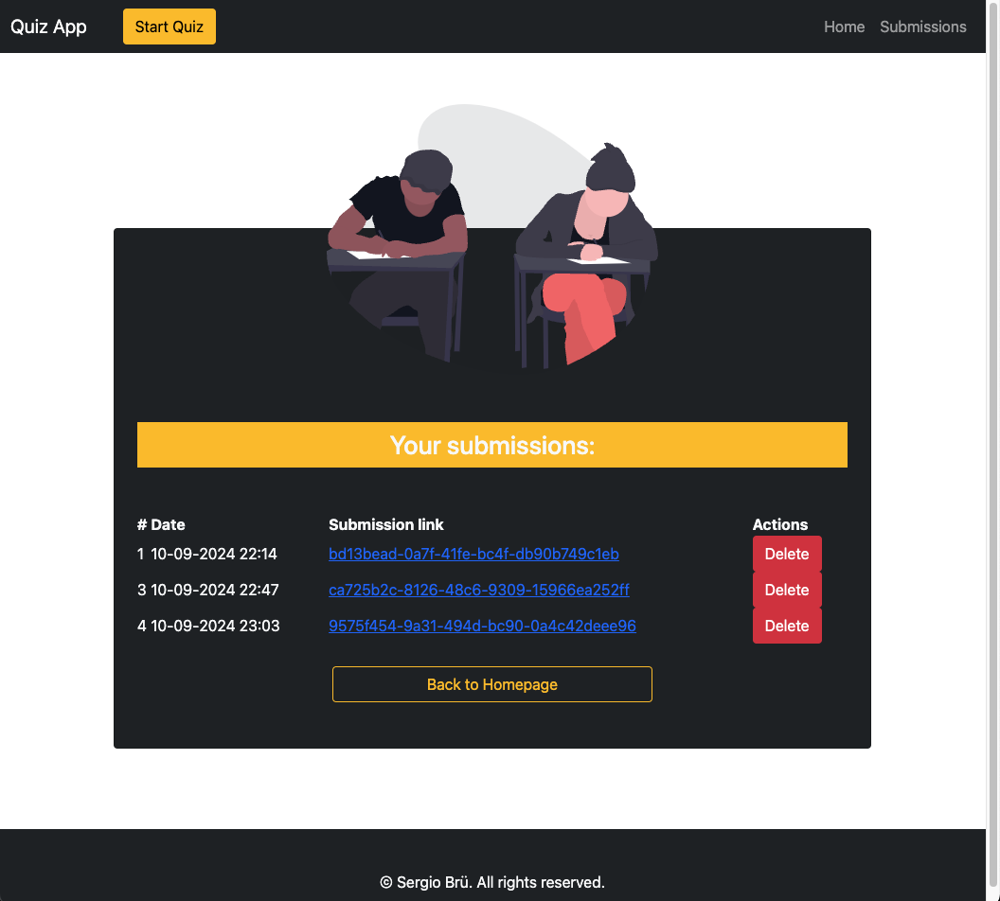
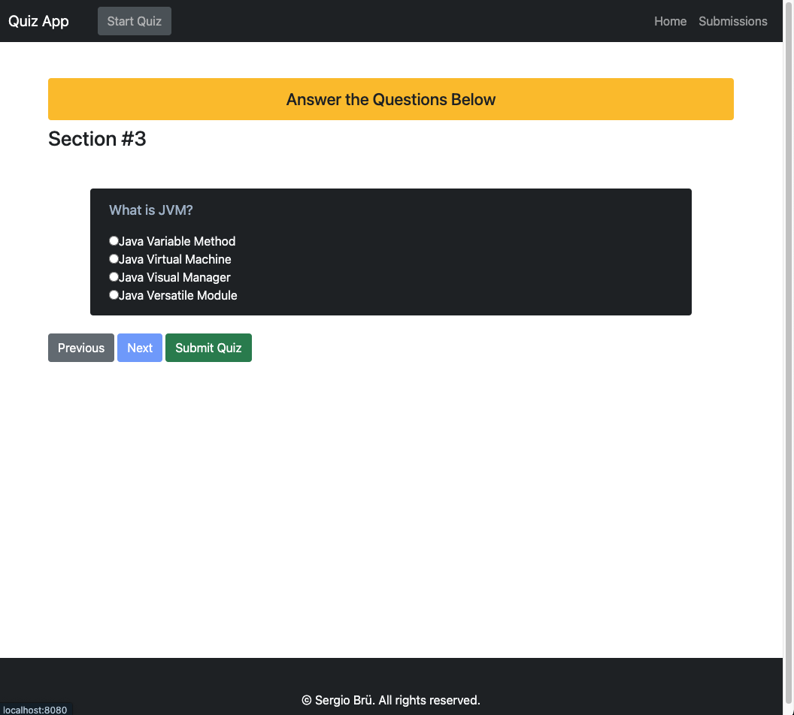
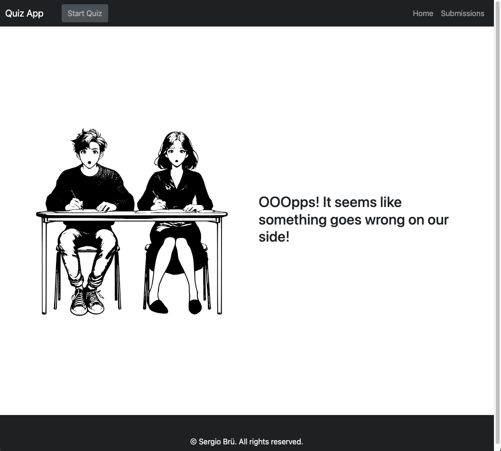

# Quiz App (java-examinator)
 ## Summary
The application is designed for use both as a standalone Spring Boot MVC application and as part of a microservice module (see the relevant section).
## Features
- **Quiz Taking:** Users can participate in quizzes featuring multiple-choice questions.
- **Answer Submission:** Users can submit their answers for each question in the quiz.
- **Submission Management:** User can view and delete submissions.
- **Answer Highlighting:** Incorrect answers are highlighted, and correct answers along with explanations are displayed.

## Data formats:
The main source of questions is questions.json:
[exam.json](./data/exam.json)
```plantuml
@startuml
title Exam JSON Structure

class Exam {
    exam_id
    sessionId
    examDate
    user
    sections
}

class User {
    id
    username
}

class Section {
    section_id
    sectionName
    userAnswers
}

class JavaQuizQuestion {
    question_id
    questionType
    questionHeader
    questionText
    difficultyLevel
    correctAnswer
    correctAnswerExplanation
    points
    choices
}

class UserAnswer {
    id: Long
    question: JavaQuizQuestion
    userAnswer: String
    correct
    pointsAwarded
}

Exam "1" -- "*" User : has
Exam "1" -- "*" Section : contains
Section "1" -- "*" UserAnswer : has
JavaQuizQuestion::question_id "1" -- "*" UserAnswer::question : has

@enduml
```

## Getting Started

To get started with the `s09-javaexaminator` module, follow these steps:

### Prerequisites
- Java 17 or higher
- Maven
- Spring Boot

### Installation

1. **Clone the Repository:**
```bash
   git clone https://github.com/zzergAtStage/java-examinator.git
```

2. **Navigate to the Project Directory:**  
```bash
cd <project-directory>
```
3. Build image  
This script will build image to run your app in container:
```bash
./build-scripts/build-images-native.sh
# run container
cd ./build-script/docker/
docker-compose build
docker-compose up -d
```

4. Run the application
```bash
mvn spring-boot:run
```

5. Use application:
```
http://localhost:8080
```
6. Import your custom exam.json  
Run command:   
```bash
curl --location 'localhost:8080/api/quiz/import' \
--form 'quiz=@"/<your custom data path>/data/exam.json"'
```

## Screenshoots
1. Logon screen:

2. Submissions page:

3. Quiz page:

4. Results page:

6. Review page:

6. Review with wrong answer:

7. Error page:

5. 
